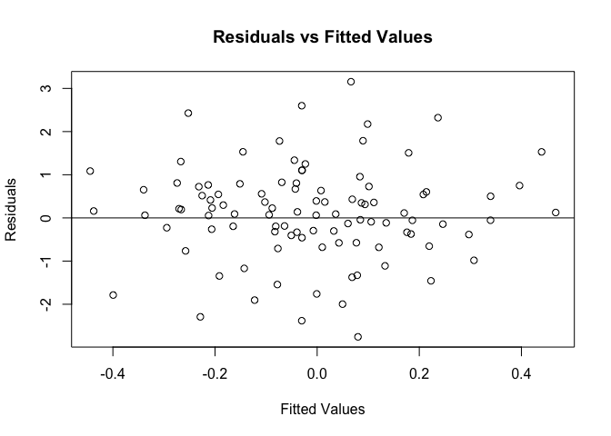
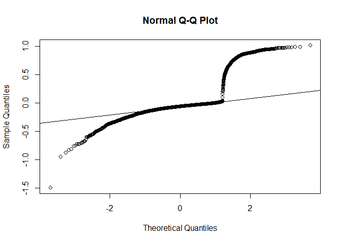
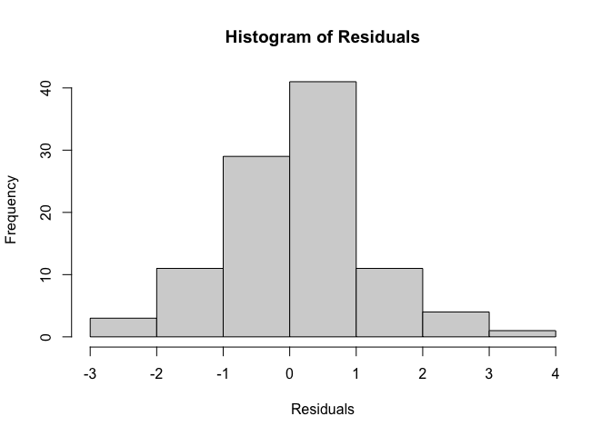

# FinalProjectGroup6

Before running our linear regression model, it is necessary to
initialize the two input variables:  
`x`: matrix with number of rows representing the number of response
(explanatory) variable  
`y`: vector representing the predictions  

We are using the `bank.csv` dataset as an example.

``` r
library(FinalProjectGroup6)
df <- read.csv2("bank.csv", header = TRUE)
df$job <- as.numeric(as.factor(df$job))
df$marital <- as.numeric(as.factor(df$marital))
df$education <- as.numeric(as.factor(df$education))
df$default <- as.numeric(as.factor(df$default))
df$housing <- as.numeric(as.factor(df$housing))
df$loan <- as.numeric(as.factor(df$loan))
df$contact <- as.numeric(as.factor(df$contact))
df$month <- as.numeric(as.factor(df$month))
df$poutcome <- as.numeric(as.factor(df$poutcome))
df$y <- as.numeric(as.factor(df$y))


x <- df[, -which(names(df) == "y")]
y <- df$y
```

The next step is to run the model by calling the `our_lm` function.

``` r
model <- our_lm(y, x, alpha = 0.05)
```

    ## Warning in sqrt(var.beta): NaNs produced
    
    ## Warning in sqrt(var.beta): NaNs produced

The individual results returned from the model can be obtained by
running a command similar to below.

``` r
# F-statistic
model$f_stat
```

    ## [1] 297.2033

Plots for the residuals can also be generated.

``` r
# residuals vs fitted-values
res_plot(model$res, model$preds)
```

<!-- -->

``` r
# qq-plot
qq_plot(model$res)
```

<!-- -->

``` r
# histogram
histogram(model$res)
```

<!-- -->
