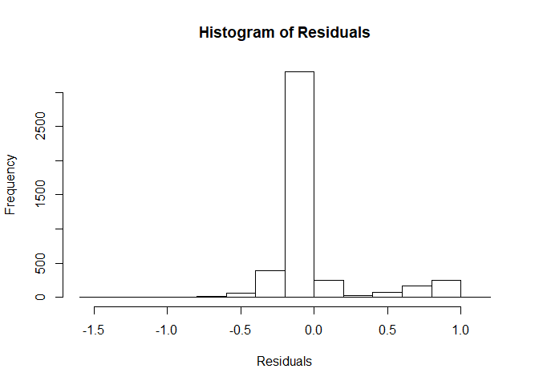

# FinalProjectGroup6

Before running our linear regression model, it is necessary to
initialize the two input variables: `x`: matrix with number of rows
representing the number of response (explanatory) variable `y`: vector
representing the predictions

``` r
library(FinalProjectGroup6)
x <- matrix(rnorm(400), ncol = 4)
y <- rnorm(100)
```

The next step is to run the model by calling the `our_lm` function.

``` r
model <- our_lm(y, x, alpha = 0.05)
```

    ## Warning in sqrt(var.beta): NaNs produced
    
    ## Warning in sqrt(var.beta): NaNs produced

``` r
model
```

    ## $beta
    ## [1] -0.286603691 -0.006483694  0.044756422  0.118772423
    ## 
    ## $sigma2
    ##          [,1]
    ## [1,] 4.365401
    ## 
    ## $variance_beta
    ##              [,1]          [,2]          [,3]         [,4]
    ## [1,]  0.053168932 -0.0014419677 -0.0046481788  0.004687015
    ## [2,] -0.001441968  0.0389768967  0.0007322328 -0.003417409
    ## [3,] -0.004648179  0.0007322328  0.0407277192 -0.002604046
    ## [4,]  0.004687015 -0.0034174087 -0.0026040461  0.041372484
    ## 
    ## $r_squared
    ## [1] 0.06066152
    ## 
    ## $mallow
    ##          [,1]
    ## [1,] 139.6928
    ## 
    ## $f_stat
    ## [1] 2.964502
    ## 
    ## $p_value
    ## [1] 0.03592672
    ## 
    ## $ci
    ##  [1] -0.738539820          NaN          NaN -0.015410192          NaN
    ##  [6] -0.393430904 -0.008279811          NaN          NaN -0.059519927
    ## [11] -0.350786062          NaN -0.420786306          NaN          NaN
    ## [16] -0.279888701  0.165332437          NaN          NaN  0.252955038
    ## [21]          NaN  0.380463517  0.097792655          NaN          NaN
    ## [26]  0.046552539  0.440298905          NaN -0.152421076          NaN
    ## [31]          NaN  0.517433547
    ## 
    ## $res
    ##               [,1]
    ##   [1,] -1.42978526
    ##   [2,]  1.21396146
    ##   [3,] -0.34316335
    ##   [4,] -1.75606563
    ##   [5,]  1.23014242
    ##   [6,]  1.37282381
    ##   [7,]  1.70169821
    ##   [8,] -1.48296597
    ##   [9,] -2.47435193
    ##  [10,]  0.87632494
    ##  [11,] -0.05204564
    ##  [12,] -1.00074992
    ##  [13,]  0.85684743
    ##  [14,] -1.12641891
    ##  [15,]  1.04368946
    ##  [16,]  1.36509322
    ##  [17,]  0.59102679
    ##  [18,]  0.10462481
    ##  [19,]  0.68640175
    ##  [20,]  0.19764595
    ##  [21,] -0.31216362
    ##  [22,] -0.61168389
    ##  [23,]  0.21212316
    ##  [24,] -1.88751945
    ##  [25,]  1.20591373
    ##  [26,]  1.30325146
    ##  [27,] -0.32149692
    ##  [28,]  0.69220816
    ##  [29,] -0.68606194
    ##  [30,] -1.17843795
    ##  [31,]  0.33888758
    ##  [32,] -0.08859972
    ##  [33,]  0.44787493
    ##  [34,] -0.75231044
    ##  [35,] -1.70656065
    ##  [36,]  0.91646305
    ##  [37,] -0.02994495
    ##  [38,] -1.00656846
    ##  [39,]  0.60597380
    ##  [40,]  0.76356530
    ##  [41,]  2.30319467
    ##  [42,] -1.94445644
    ##  [43,]  0.15855977
    ##  [44,]  0.44239646
    ##  [45,] -0.82297922
    ##  [46,]  1.28107724
    ##  [47,]  0.08696255
    ##  [48,] -1.28989845
    ##  [49,] -0.86296606
    ##  [50,]  0.64632219
    ##  [51,] -0.20442220
    ##  [52,] -0.21511975
    ##  [53,] -0.25597170
    ##  [54,]  0.08244698
    ##  [55,] -0.16374398
    ##  [56,] -0.18470184
    ##  [57,]  0.02568051
    ##  [58,]  0.57108445
    ##  [59,] -1.06336601
    ##  [60,] -1.53243024
    ##  [61,]  1.08597375
    ##  [62,]  1.12820234
    ##  [63,]  0.82179439
    ##  [64,]  0.10919957
    ##  [65,]  0.35023255
    ##  [66,] -0.75052370
    ##  [67,] -2.02573097
    ##  [68,] -1.02760452
    ##  [69,]  0.32530813
    ##  [70,]  0.77515379
    ##  [71,]  0.10176946
    ##  [72,]  0.02557053
    ##  [73,] -0.85642720
    ##  [74,]  0.07757177
    ##  [75,] -0.45579381
    ##  [76,] -0.36338970
    ##  [77,] -0.87808095
    ##  [78,]  0.25558957
    ##  [79,]  0.13065555
    ##  [80,]  1.62233854
    ##  [81,] -2.37594319
    ##  [82,] -0.22132829
    ##  [83,]  0.40099642
    ##  [84,] -2.03680816
    ##  [85,] -0.81656697
    ##  [86,]  1.17385817
    ##  [87,] -0.81029350
    ##  [88,]  0.46026449
    ##  [89,] -0.47467421
    ##  [90,] -0.54274375
    ##  [91,]  0.54392551
    ##  [92,]  0.07563725
    ##  [93,] -0.51079102
    ##  [94,]  1.19728512
    ##  [95,] -0.54971074
    ##  [96,] -1.23325619
    ##  [97,] -1.02183631
    ##  [98,]  1.72210053
    ##  [99,]  0.56462911
    ## [100,] -2.28455632
    ## 
    ## $preds
    ##                [,1]
    ##   [1,] -0.028630630
    ##   [2,] -0.019072954
    ##   [3,]  0.168387447
    ##   [4,] -0.142149670
    ##   [5,]  0.249122453
    ##   [6,] -0.186310842
    ##   [7,] -0.148775170
    ##   [8,]  0.115223965
    ##   [9,] -0.052369829
    ##  [10,]  0.057015223
    ##  [11,] -0.135802841
    ##  [12,]  0.283384263
    ##  [13,]  0.065041945
    ##  [14,] -0.352451166
    ##  [15,] -0.065770236
    ##  [16,] -0.089520784
    ##  [17,]  0.179476504
    ##  [18,] -0.133409371
    ##  [19,] -0.190343432
    ##  [20,] -0.028631139
    ##  [21,] -0.181488417
    ##  [22,] -0.106714619
    ##  [23,]  0.142826023
    ##  [24,]  0.043655183
    ##  [25,]  0.058081788
    ##  [26,] -0.304074568
    ##  [27,] -0.213156677
    ##  [28,] -0.835303347
    ##  [29,] -0.202466588
    ##  [30,]  0.373810135
    ##  [31,] -0.375666559
    ##  [32,]  0.420374858
    ##  [33,] -0.271746228
    ##  [34,]  0.035773210
    ##  [35,] -0.669881220
    ##  [36,] -0.099456180
    ##  [37,]  0.160831363
    ##  [38,] -0.387491472
    ##  [39,] -0.094062554
    ##  [40,] -0.295368804
    ##  [41,]  0.344577651
    ##  [42,]  0.311543280
    ##  [43,] -0.204839932
    ##  [44,] -0.393996602
    ##  [45,] -0.039162883
    ##  [46,]  0.103412711
    ##  [47,]  0.112868239
    ##  [48,]  0.074184786
    ##  [49,] -0.141669171
    ##  [50,]  0.366318035
    ##  [51,]  0.133937115
    ##  [52,]  0.402604642
    ##  [53,] -0.003577533
    ##  [54,]  0.139164518
    ##  [55,]  0.236467669
    ##  [56,] -0.102432425
    ##  [57,] -0.264375366
    ##  [58,]  0.319343609
    ##  [59,]  0.143700854
    ##  [60,] -0.118752075
    ##  [61,]  0.385040710
    ##  [62,] -0.950332580
    ##  [63,]  0.201693506
    ##  [64,]  0.243612049
    ##  [65,]  0.372051239
    ##  [66,] -0.085228255
    ##  [67,] -0.198532416
    ##  [68,] -0.011983971
    ##  [69,] -0.806539041
    ##  [70,]  0.443861309
    ##  [71,]  0.154117009
    ##  [72,] -0.041624107
    ##  [73,]  0.059339261
    ##  [74,] -0.701791688
    ##  [75,]  0.284497269
    ##  [76,] -0.223156377
    ##  [77,] -0.479265383
    ##  [78,] -0.364106279
    ##  [79,]  0.017096528
    ##  [80,]  0.415785833
    ##  [81,] -0.098647010
    ##  [82,] -0.260444916
    ##  [83,] -0.125690679
    ##  [84,] -0.197348837
    ##  [85,] -0.064797505
    ##  [86,]  0.150755588
    ##  [87,]  0.149804829
    ##  [88,] -0.316675491
    ##  [89,]  0.215705627
    ##  [90,] -0.320154824
    ##  [91,] -0.188551083
    ##  [92,] -0.437669337
    ##  [93,] -0.104326475
    ##  [94,] -0.403619608
    ##  [95,]  0.316318272
    ##  [96,] -0.167898960
    ##  [97,] -0.360666606
    ##  [98,] -0.715147206
    ##  [99,]  0.374636010
    ## [100,]  0.359670914

The individual results returned from the model can be obtained by
running a command similar to below.

``` r
# F-statistic
model$f_stat
```

    ## [1] 2.964502

Plots for the residuals can also be generated.

``` r
# residuals vs fitted-values
res_plot(model$res, model$preds)
```

<!-- -->

``` r
# qq-plot
qq_plot(model$res)
```

<!-- -->

``` r
# histogram
histogram(model$res)
```

<!-- -->
