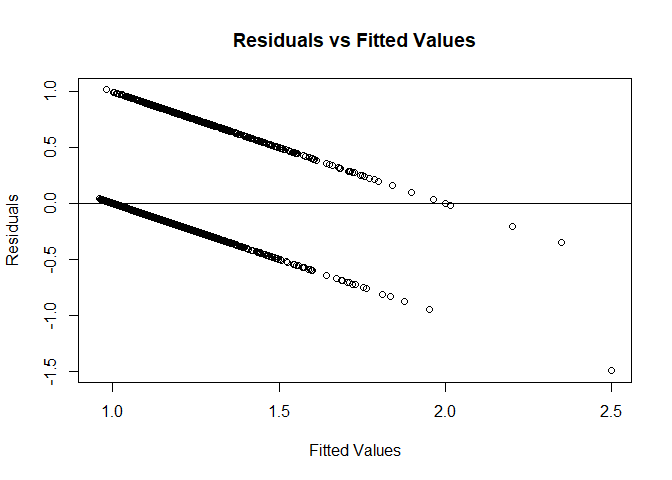

# FinalProjectGroup6

[Package Repository:
Final\_Project\_Group6](https://github.com/AU-R-Programming/Final_Project_Group6)

Before running our linear regression model, it is necessary to
initialize the two input variables:  
`x`: matrix with number of rows representing the number of response
(explanatory) variable  
`y`: vector representing the predictions  

We are using the `bank.csv` dataset as an example.

``` r
library(FinalProjectGroup6)
df <- read.csv2("bank.csv", header = TRUE)
df$job <- as.numeric(as.factor(df$job))
df$marital <- as.numeric(as.factor(df$marital))
df$education <- as.numeric(as.factor(df$education))
df$default <- as.numeric(as.factor(df$default))
df$housing <- as.numeric(as.factor(df$housing))
df$loan <- as.numeric(as.factor(df$loan))
df$contact <- as.numeric(as.factor(df$contact))
df$month <- as.numeric(as.factor(df$month))
df$poutcome <- as.numeric(as.factor(df$poutcome))
df$y <- as.numeric(as.factor(df$y))


x <- df[, -which(names(df) == "y")]
x <- x[c("age", "balance", "duration")]
y <- df$y
```

The next step is to run the model by calling the `our_lm` function. We
compare our results to those of the built-in `lm` function. We can see
that the results are very similar.

``` r
model <- our_lm(y, x, alpha = 0.05)
```

    ## Warning in sqrt(var.beta): NaNs produced
    
    ## Warning in sqrt(var.beta): NaNs produced

``` r
model2 <- lm(y ~ x$age + x$balance + df$duration)
model$beta
```

    ## [1] 9.266616e-01 1.342707e-03 2.178674e-06 4.933943e-04

``` r
model2$coefficients
```

    ##  (Intercept)        x$age    x$balance  df$duration 
    ## 9.267811e-01 1.338111e-03 2.185320e-06 4.934805e-04

The individual results returned from the model can be obtained by
running a command similar to below.

``` r
# F-statistic
model$f_stat
```

    ## [1] 294.0769

Plots for the residuals can also be generated.

``` r
# residuals vs fitted-values
res_plot(model$res, model$preds)

# qq-plot
qq_plot(model$res)

# histogram
histogram(model$res)
```


